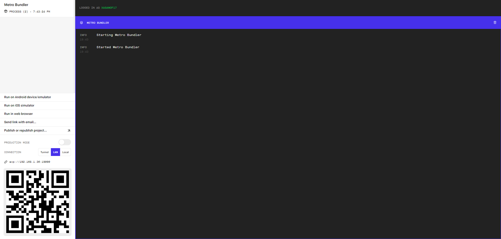

# Getting Started with Create Expo App

This project was bootstrapped with [Create React Native App](https://github.com/topics/react-native).

## Available Scripts

In the project directory, you can run:

- `npm install`
	> To install node_modules, this is need to run project. Then:
	
- `npm start` or `expo start`
	> To start this project on Metro Bundler [http://localhost:19002](http://localhost:19002). Then
- `expo start`
	> This code to work you must install expo-cli: `npm i -g expo-cli` 

- **Metro Bundler** is created *QR_CODE* to you see this. 
   > Do you want to see this project on your mobile ? So you must install mobile app [Expo Go](https://play.google.com/store/apps/details?id=host.exp.exponent&hl=ru&gl=US) 
> You see this project on your device **iOS** or **Android**, or on Metro Bundler **website**	

